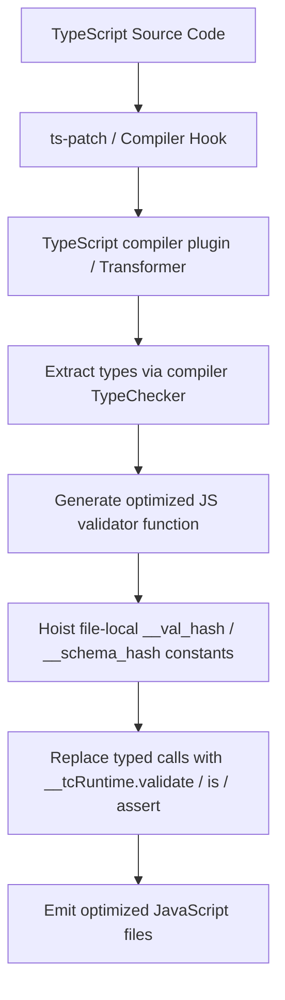

# @webergency-utils/typechecker

An ahead-of-time (AOT) TypeScript validation engine that compiles types into optimized runtime validators via a compiler transformer—no runtime reflection and no third-party schema library.

[](https://www.npmjs.com/package/@webergency-utils/typechecker)
[](https://www.npmjs.com/package/@webergency-utils/typechecker)
[](#maintenance)
[](https://www.npmjs.com/package/@webergency-utils/typechecker?activeTab=dependencies)
[](https://www.npmjs.com/package/@webergency-utils/typechecker)
<br>
[](https://securityscorecards.dev/viewer/?uri=github.com/webergency-utils/typechecker)
[](https://codecov.io/gh/webergency-utils/typechecker)
[](https://github.com/webergency-utils/typechecker/actions/workflows/ci.yml)
[](https://github.com/webergency-utils/typechecker/actions/workflows/codeql.yml)

## TL;DR

```typescript
import { validate, constraint, format } from '@webergency-utils/typechecker';

interface User {
  id: string & format.UUID;
  name: string & constraint.MinLength<2>;
  age: number & constraint.Minimum<18>;
}

const input: unknown = {
  id: '550e8400-e29b-41d4-a716-446655440000',
  name: 'Alice',
  age: 25,
};

// Validate input against the User type definition
const result = validate<User>(input);

if (result.success) {
  // TypeScript narrows type to User here
  console.log('User is valid:', result.data);
} else {
  console.error('Validation failed:', result.errors);
}
```

## Installation & Setup

This package is a TypeScript compiler plugin (transformer). You must compile with a compiler patcher such as `ts-patch` so the transformer can hook into `tsc`.

**Peer dependency:** `typescript` `>=5.0.0` (required; provides the compiler API the transformer and language service plugin use).

There are **no runtime `dependencies`**—only the peer `typescript` and your build tooling.

### 1. Install Dependencies

Install the core package, along with `ts-patch` as a development dependency:

```bash
npm install @webergency-utils/typechecker
npm install --save-dev ts-patch
```

### 2. Inject Compiler Hook

Run the patcher command to set up `ts-patch` inside your local TypeScript installation:

```bash
npx ts-patch install
```

> [!NOTE]
> It is recommended to add `ts-patch install` to your `package.json` `prepare` script so it runs automatically after every dependency installation.

### 3. Configure tsconfig.json

Register the typechecker **transformer** (and optionally the language service plugin) under `compilerOptions.plugins` in `tsconfig.json`:

```json
{
  "compilerOptions": {
    "target": "ES2022",
    "module": "NodeNext",
    "moduleResolution": "NodeNext",
    "plugins": [
      { "transform": "@webergency-utils/typechecker/transformer" },
      { "name": "@webergency-utils/typechecker/plugin" }
    ]
  }
}
```

The `transform` entry is required for AOT validation. The `name` entry enables IDE constraint diagnostics via the language service plugin.
---

## Architecture & Internals

The package utilizes a custom TypeScript compiler transformer and language service plugin to deliver highly efficient type-safe runtime validations.

### Build-Time Compilation Flow



1. **Build-Time Transformation**: The compiler transformer intercepts typed helper calls (`validate`, `is`, `assert`, `assertGuard`, `jsonSchema`). Schema helpers (`validateSchema`, `isSchema`, `assertSchema`, `assertGuardSchema`) are plain runtime APIs and do not require transformation.
2. **Type Extraction & Analysis**: It parses the target TS type structure, extracting intersection constraints, formats, transforms, and defaults recursively.
3. **File-local validators**: The transformer generates highly optimized JavaScript validator functions for each resolved type shape, names them with a structural hash (`__val_<hash>` / `__schema_<hash>`), and hoists them in the same file.
4. **Call Replacement**: Typed calls are rewritten to `__tcRuntime.validate(__val_<hash>, …)` (and the matching `is` / `assert` / `assertGuard` helpers) with no global registry lookup.

### External dependencies

- **Required peer:** `typescript` (`>=5.0.0`) — compiler API for the transformer and optional language service plugin.
- **Required build tooling:** `ts-patch` (or equivalent) — patches `tsc` so `compilerOptions.plugins` `transform` entries run.
- **Runtime dependencies:** none.

### Static Constraint Diagnostics

The package includes an IDE / Language Service plugin that statically checks literal values against type constraints during editing or compilation:

```typescript
import { constraint } from '@webergency-utils/typechecker';

// This yields a compilation error directly in the IDE:
// Type '5' is not assignable to type 'number & Minimum<18>'.
const age: number & constraint.Minimum<18> = 5;
```

---

## Glossary

- [`validate`](src/index.ts): Validates a value against a type, returning a structured result containing the validation status and a detailed list of errors.
- [`is`](src/index.ts): A type guard for `T`. Always mutates in place; `from` may coerce nested fields. Root replacement fails the guard.
- [`assert`](src/index.ts): Validates a value and returns it, throwing a validation error on failure (supports `from` coercion).
- [`assertGuard`](src/index.ts): Asserts a value is `T`. Always mutates in place; `from` may coerce nested fields. Root replacement throws.
- [`jsonSchema`](src/index.ts): Generates and returns a JSON Schema representation matching a TypeScript type at compile time (draft-07 shaped, with `x-typescript-type` for Date/RegExp/Set/Map/bigint/etc.).
- [`validateSchema`](src/index.ts) / [`isSchema`](src/index.ts) / [`assertSchema`](src/index.ts) / [`assertGuardSchema`](src/index.ts): Same entrypoints against a runtime JSON Schema value instead of a TypeScript generic.
- [`WithModifiers`](src/runtime/tags.ts): A utility type that applies constraint, format, or transformation tags to properties of deeply nested or external types using dot-separated path mappings.
- [`ResolveDefaults`](src/runtime/tags.ts): A helper type that removes the optional flag (`?`) from properties that have defined default values.
- [`convertPropertyCasing`](src/runtime/casing.ts): A runtime utility to recursively change the casing of object keys.
- [`toZodIssues`](src/runtime/validators.ts) / [`groupErrorsByPath`](src/runtime/validators.ts): Transform or group validation errors (including nested union `issues`).
- [`ZodLikeError`](src/runtime/validators.ts): Error class wrapping validation errors in a structure compatible with libraries expecting Zod errors.
- [`@webergency-utils/typechecker/transformer`](src/transformer.ts): Required `ts-patch` transform entry for AOT rewrite.
- [`@webergency-utils/typechecker/plugin`](src/plugin.ts): Optional language-service plugin for IDE static constraint diagnostics.

---

## API Reference

### Validation Functions

#### `validate<T>(input: unknown, options?: ValidationMode | ValidationOptions): IValidation<ResolveDefaults<T>>`

Validates input data against type `T` and returns a structured validation result.

- **Parameters**:
  - `input`: The value to validate.
  - `options` (optional): Either a `ValidationMode` string ('strict' | 'relaxed' | 'strip') or a `ValidationOptions` object.
- **Returns**: `IValidation<ResolveDefaults<T>>` containing validation status, converted/stripped data, and error details.
- **Example**:
  ```typescript
  const result = validate<User>(data, 'strip');
  ```

#### `is<T>(input: unknown, options?: ValidationMode | GuardOptions): input is ResolveDefaults<T>`

A type guard for type `T`. Always mutates in place (no `mutate` option). `from` may coerce nested fields onto the same object; if validation would replace the root value (e.g. primitive `"42"` → `42`), returns `false`.

- **Parameters**:
  - `input`: The value to check.
  - `options` (optional): Either a `ValidationMode` string or a `GuardOptions` object.
- **Returns**: `boolean` (`true` if valid, `false` otherwise). Narrows type of `input` to `ResolveDefaults<T>` on success.
- **Example**:
  ```typescript
  if (is<User>(data)) {
    console.log(data.name);
  }
  ```

#### `assert<T>(input: unknown, options?: ValidationMode | AssertOptions): ResolveDefaults<T>`

Validates input data and returns it, throwing a validation error on failure.

- **Parameters**:
  - `input`: The value to validate.
  - `options` (optional): Either a `ValidationMode` string or an `AssertOptions` object.
- **Returns**: `ResolveDefaults<T>` (the validated value with defaults resolved).
- **Throws**: `Error` containing a list of path and constraint failures, or a custom error via `options.errorFactory`.
- **Example**:
  ```typescript
  const user = assert<User>(data);
  ```

#### `assertGuard<T>(input: unknown, options?: ValidationMode | AssertGuardOptions): asserts input is ResolveDefaults<T>`

An assertion guard for type `T`. Always mutates in place (no `mutate` option). `from` may coerce nested fields; root replacement fails with a normal type error (re-checked without `from`).

- **Parameters**:
  - `input`: The value to check.
  - `options` (optional): Either a `ValidationMode` string or an `AssertGuardOptions` object.
- **Returns**: `void`. Narrows the type of `input` in the enclosing scope on success.
- **Throws**: `Error` if validation fails (or a custom error via `options.errorFactory`).
- **Example**:
  ```typescript
  assertGuard<User>(data);
  ```

#### `jsonSchema<T>(): any`

Generates a raw JSON Schema draft-07 object matching type `T` at compile time.

- **Returns**: `any` (a JSON Schema object).
- **Example**:
  ```typescript
  const userSchema = jsonSchema<User>();
  ```

#### `validateSchema<T = any>(schema: any, input: unknown, options?: ValidationMode | ValidationOptions): IValidation<T>`

Validates `input` against a **runtime JSON Schema** value (not a TypeScript generic).

Only the documented schema subset is compiled. Recognized validation keywords that are not implemented
(for example `enum`, `oneOf`, and `not`) throw during schema compilation instead of silently accepting data.
Schema `pattern` values are rejected when they exceed the safety limit or contain common catastrophic-backtracking constructs.

- **Parameters**:
  - `schema`: JSON Schema object.
  - `input`: The value to validate.
  - `options` (optional): Same as `validate`.
- **Example**:
  ```typescript
  const result = validateSchema({ type: 'string', minLength: 2 }, name);
  ```

#### `isSchema(schema: any, input: unknown, options?: ValidationMode | GuardOptions): boolean`

Schema type-predicate. Always mutates in place; root replacement fails the guard.

#### `assertSchema<T = any>(schema: any, input: unknown, options?: ValidationMode | AssertOptions): T`

Like `assert`, but against a JSON Schema value.

#### `assertGuardSchema(schema: any, input: unknown, options?: ValidationMode | AssertGuardOptions): void`

Like `assertGuard`, but against a JSON Schema value. Root replacement throws.

---

### Utility Functions and Classes

#### `convertPropertyCasing<T, C extends CasingFormat>(obj: T, casing: C, options?: ConvertCasingOptions): ConvertPropertyCasing<T, C>`

Recursively converts all property keys of an object to the specified casing format.
If two source keys normalize to the same output key, conversion throws instead of silently discarding a value.
Special keys such as `__proto__` are preserved as own data properties without changing the result prototype.

- **Parameters**:
  - `obj`: The source object.
  - `casing`: A `CasingFormat` string value (`'snake_case' | 'SNAKE_CASE' | 'camelCase' | 'camelCaseID' | 'PascalCase' | 'PascalCaseID' | 'kebab-case' | 'dot.case'`).
  - `options` (optional): `ConvertCasingOptions` object.
- **Returns**: The casing-converted object with updated TypeScript property keys.
- **Example**:
  ```typescript
  const apiResponse = convertPropertyCasing(user, 'camelCase');
  ```

#### `toZodIssues(errors: IValidationError[]): any[]`

Converts internal validation errors into Zod-compatible issues. Flattens nested union `issues` into a flat list.

- **Parameters**:
  - `errors`: Array of `IValidationError`.
- **Returns**: An array of Zod-like issues.

#### `groupErrorsByPath(errors: IValidationError[]): Record<string, { value: any, errors: string[] }>`

Groups validation errors by path, including nested `issues` from failed unions.

- **Parameters**:
  - `errors`: Array of `IValidationError`.
- **Returns**: A map of path → `{ value, errors }`.

#### `coerceQueryNumber(v: any): any` / `coerceQueryBoolean(v: any): any` / `coerceQueryDate(v: any): any` / `coerceJsonDate(v: any): any`

Shared coercion helpers used by `from: 'query'` / `from: 'json'` and by `transform.ToNumber` / `ToBoolean` / `ToDate`.

#### `class ZodLikeError extends Error`

An error class wrapper that transforms internal validation errors into a Zod-like error structure.

- **Constructor**: `constructor(errors: IValidationError[])`
- **Properties**:
  - `name`: `'ZodError'`
  - `issues`: Zod-like issue array.

---

### Interfaces and Types

#### `type ValidationMode`

Controls **unknown object keys only**. It does **not** coerce or revive values — that is exclusively `from`.

| Value | Behavior |
| :--- | :--- |
| `'strict'` (default) | Reject properties not declared on the type/schema. |
| `'relaxed'` | Allow unknown properties and keep them on the result. No type conversion. |
| `'strip'` | Drop unknown properties from the result (in place when mutating). |

```typescript
// OK: extra keys kept; age stays a string unless you also set from
validate<User>(data, 'relaxed');

// Coercion is a separate axis:
validate<User>(data, { mode: 'relaxed', from: 'query' });
```

#### `interface GuardOptions`

Options for `is` / `isSchema`. Always mutate in place (no `mutate` / `errorFactory`).

| Property | Type | Default | Description |
| :--- | :--- | :--- | :--- |
| `mode` | `ValidationMode` | `'strict'` | Unknown-key policy (`strict` / `relaxed` / `strip`). Not coercion — see `ValidationMode` above. |
| `from` | `'json' \| 'query' \| ((val, ctx) => any)` | `undefined` | In-place coercion for nested fields. Custom callbacks receive `(val, PathContext & { kind: CoercionKind })`. Root replacement fails the guard. |

#### `interface AssertGuardOptions`

Extends `GuardOptions` for `assertGuard` / `assertGuardSchema`.

| Property | Type | Default | Description |
| :--- | :--- | :--- | :--- |
| `errorFactory` | `(errors: IValidationError[]) => Error` | `undefined` | Custom error factory when the guard throws. |

#### `interface ValidationOptions`

Extends `GuardOptions` for `validate` / `validateSchema` (adds `mutate`; no `errorFactory`).

| Property | Type | Default | Description |
| :--- | :--- | :--- | :--- |
| `mode` | `ValidationMode` | `'strict'` | Unknown-key policy (`strict` / `relaxed` / `strip`). Not coercion — see `ValidationMode` above. |
| `from` | `'json' \| 'query' \| ((val, ctx) => any)` | `undefined` | Input conversion mode. `'json'` revives JSON-impossible types. `'query'` also coerces querystring shapes. A custom function is `(val, { key, path, parent, root, index?, kind }) => any` and runs only on type mismatch. `kind` is a `CoercionKind` dispatch tag (not `typeof` / a TS type). `key` is the nearest named path segment (for `[n]` leaves, the closest named key above). |
| `mutate` | `boolean` | `false` | `true`: write in place while validating (half-changed input on failure is allowed; union arms still use a side tree). `false`: always allocate new containers. |

#### `interface AssertOptions`

Extends `ValidationOptions` for `assert` / `assertSchema`.

| Property | Type | Default | Description |
| :--- | :--- | :--- | :--- |
| `errorFactory` | `(errors: IValidationError[]) => Error` | `undefined` | Custom error factory when assert throws. |

#### `type CoercionKind` / `interface PathContext` / `type FromCoercionContext`

- `CoercionKind`: expected runtime kind for custom `from` (`'Date' \| 'Array' \| …`) — a dispatch tag, not `typeof`.
- `PathContext`: `{ key, path, parent, root, index? }` shared by `constraint.Custom` and custom `from`.
- `FromCoercionContext`: `PathContext & { kind: CoercionKind }`.

#### `interface IValidation<T>`

Result object returned by `validate`.

- `success`: `boolean`
- `data?`: `T` — present only when `success` is `true`
- `errors?`: `IValidationError[]`

#### `interface IValidationError`

Details of a validation check failure.

- `path`: `string`
- `value`: `any`
- `error`: `string` (the constraint description or custom message)
- `issues?`: `IValidationError[]` — nested failures (used for unions: one summary error with per-arm details)

#### `type WithModifiers<T, M>`

Applies constraint, format, or transformation tags to properties of type `T` using a path mapping `M`.

- **Generics**:
  - `T`: The baseline type to wrap.
  - `M`: A key-value map where keys are dot-separated paths (e.g., `'profile.email'`) and values are tags.

---

### Tags & Modifiers

#### `constraint` Namespace

Used to apply value constraints to types.

| Tag | Description |
| :--- | :--- |
| `constraint.MinLength<N, Msg?>` | Restricts string length to $\ge N$. |
| `constraint.MaxLength<N, Msg?>` | Restricts string length to $\le N$. |
| `constraint.Length<Min, Max>` | Shorthand for `MinLength<Min> & MaxLength<Max>`. |
| `constraint.Pattern<Regex, Msg?>` | Validates string using regular expression `Regex`. |
| `constraint.Minimum<N, Msg?>` | Inclusive minimum value restriction for `number | bigint`. |
| `constraint.Maximum<N, Msg?>` | Inclusive maximum value restriction for `number | bigint`. |
| `constraint.Range<Min, Max>` | Shorthand for `Minimum<Min> & Maximum<Max>`. |
| `constraint.ExclusiveMinimum<N, Msg?>` | Exclusive minimum value restriction for `number | bigint`. |
| `constraint.ExclusiveMaximum<N, Msg?>` | Exclusive maximum value restriction for `number | bigint`. |
| `constraint.MultipleOf<N, Msg?>` | Restricts `number | bigint` to multiples of `N`. |
| `constraint.MinItems<N, Msg?>` | Restricts array length to $\ge N$. |
| `constraint.MaxItems<N, Msg?>` | Restricts array length to $\le N$. |
| `constraint.UniqueItems<Msg?>` | Restricts arrays to deeply unique items. |
| `constraint.Custom<Fn, Msg?>` | Runs a custom validation function: `(val, PathContext) => boolean` (`key`, `path`, `parent`, `root`, optional `index`). |
| `constraint.Requires<Path | [Paths], Msg?>` | Enforces that other object property paths exist. |
| `constraint.Message<Msg>` | Fallback custom error message. |

#### `format` Namespace

Standard formats for string primitives.

- `format.Email`: Practical mailbox check (`local@domain`, length limits, DNS-like domain with a real TLD). Not full RFC 5322.
- `format.IdnEmail`: Like email, but Unicode local/domain labels allowed.
- `format.UUID`: UUID (v1-v8, plus the nil UUID).
- `format.URL`: HTTP/HTTPS/FTP URLs.
- `format.IPv4` / `format.IPv6`: IP addresses.
- `format.Date`: `YYYY-MM-DD` validated via `new Date(...)` (calendar overflow like `2024-02-31` is allowed). With `from: 'query'`, the runtime value becomes a `Date` (the TypeScript type remains `string & format.Date`).
- `format.DateTime`: date-time validated via `new Date(...)`. With `from: 'query'`, returns a `Date`; otherwise keeps the string.
- `format.ObjectId`: MongoDB 24-character hex ObjectId.
- `format.Duration`: ISO-8601 duration.
- `format.Time`: Time string `HH:MM:SS` in real ranges (`00-23`, `00-59`, `00-59`) with an optional fraction and a required timezone (`Z` or `±HH:MM`), e.g. `19:55:00Z`.
- `format.Byte`: Base64 string.
- `format.Password`: Any string (always valid placeholder).
- `format.Regex`: Valid regular expression string.
- `format.Hostname`: ASCII domain name (includes `localhost`).
- `format.IdnHostname`: Internationalized hostname (Unicode labels).
- `format.URI`: Absolute URI.
- `format.UriReference`: Absolute URI or relative reference.
- `format.IRI`: Absolute IRI (Unicode URI).
- `format.IriReference`: Absolute IRI or relative reference.
- `format.UriTemplate`: RFC 6570 URI template.
- Unknown `Format<'...'>` strings fail validation at runtime.

Object and record shapes accept **record-like** values (plain objects, null-prototype objects, `process.env`, class instances used as bags). Exotics (`Date`, `Map`, `Set`, arrays, typed arrays, `Buffer`, …) are rejected unless the type is a dedicated instance type. A real `class` used as a type is checked with `instanceof` (nominal); interfaces and type literals stay structural.

#### `transform` Namespace

Sanitizes and converts input values during validation.

- `transform.Trim`: Trims string whitespace.
- `transform.LowerCase`: Converts string to lowercase.
- `transform.UpperCase`: Converts string to uppercase.
- `transform.Capitalize`: Capitalizes the first letter.
- `transform.ToNumber`: Same coercion as `from: 'query'` for numbers. The entire trimmed string must be a finite decimal/scientific number; partial strings, hexadecimal syntax, `NaN`, and infinities are rejected.
- `transform.ToBoolean`: Same coercion as `from: 'query'` for booleans (`true`/`false`/`1`/`0`/`yes`/`no`/`on`/`off`); unknown values are left unchanged and fail the boolean check.
- `transform.ToDate`: Same coercion as `from: 'query'` for dates (parseable strings and finite timestamps).
- `transform.Custom<Fn>`: Custom mapping function: `(val) => any`.

#### `tag` Namespace

- `tag.Default<Value>`: Injects `Value` when a property is undefined. Removes the optional modifier (`?`) when resolved with `ResolveDefaults<T>`.

---

## Troubleshooting

### `validate`, `is`, or `assert` throw “transformer was not applied”
- **Cause**: The compiler transformer did not rewrite the call at build time. Untransformed stubs always throw.
- **Diagnostics Check**: Inspect your built `.js` output. If it still contains `validate(...)` / `is(...)` / `assert(...)` as package imports rather than `__tcRuntime.validate(...)` (etc.), the transformer did not run.
- **Fix**:
  1. Verify `npx ts-patch install` was executed successfully.
  2. Verify `{ "transform": "@webergency-utils/typechecker/transformer" }` is registered in `tsconfig.json` `compilerOptions.plugins`.
  3. Ensure your bundler or compiler CLI compiles using patched `tsc`.

### IDE does not report constraint errors on literals
- **Cause**: The optional language service plugin is not loaded.
- **Fix**: Add `{ "name": "@webergency-utils/typechecker/plugin" }` alongside the transformer entry in `tsconfig.json` plugins, and restart the TypeScript language service in your editor.

---

## Maintenance

This package is actively maintained.

Bug reports and pull requests are welcome. Security issues and critical
regressions are prioritized. New features are considered when they align
with the package's existing scope.
